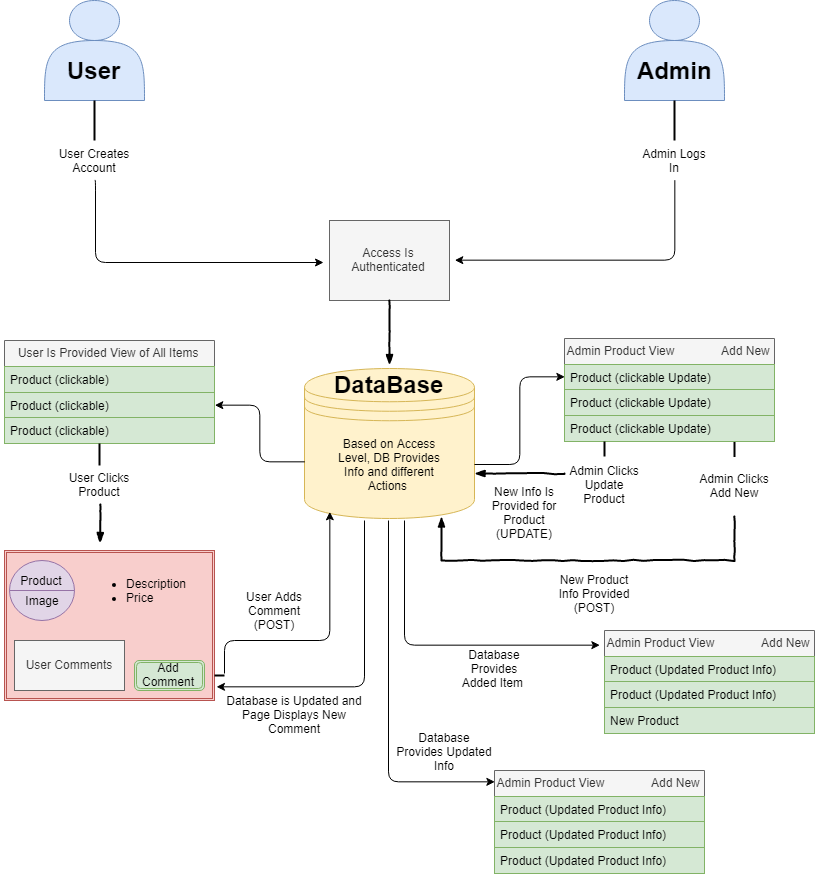

# Prime Product (Project Two)

# Team Members

Hunter Rickert, Nick Leone, David Thayer

# Project Description

User will be able to create a login. From the login the User will be able to view all products and get additional details on a specific product by clicking. If the user wishes they can comment on a particular item and that comment will be stored and displayed.

Admin will be able to view all items, update existing inventory items, add additional items to the inventory. Admin access will be authenticated to verify Users will not be able to add or manipulate inventory.

# Flowchart

# Rough Breakdown of Tasks 

Create File structure (MVC)

Set up server

Create schema and seeds for the database

Create Handlebars files

Crate Different Handlebars Views

Create Models for What Will be Stored in Database

Create API-routes for admin, add item, all inventory, etc..

Create HTML-routes going to the different views for handlebars pages

Create GET methods to view all items and individual items

Create POST methods for admin to create new items, and users to comment on items

Add User Authentication, User sign up

